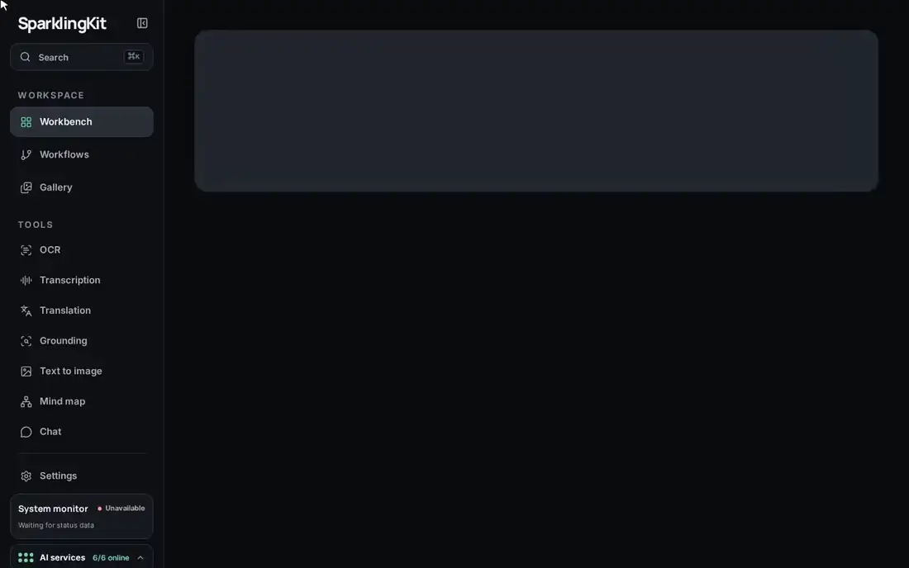
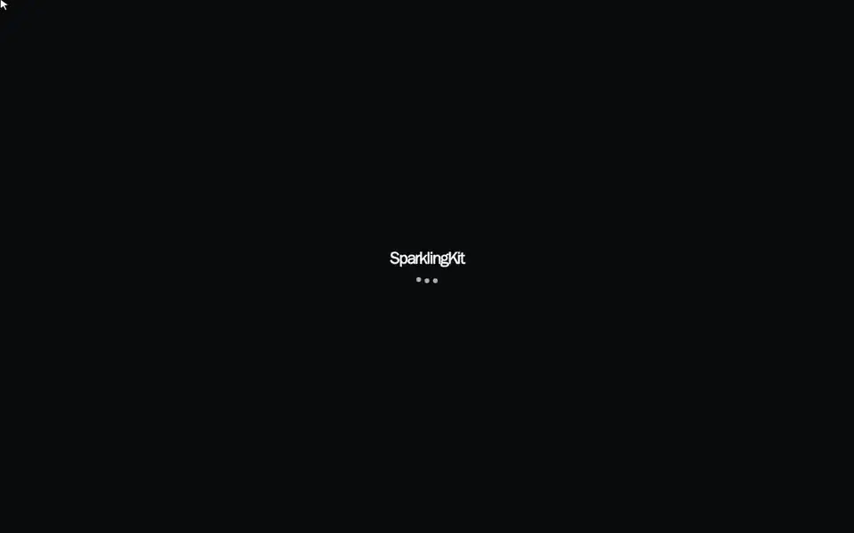
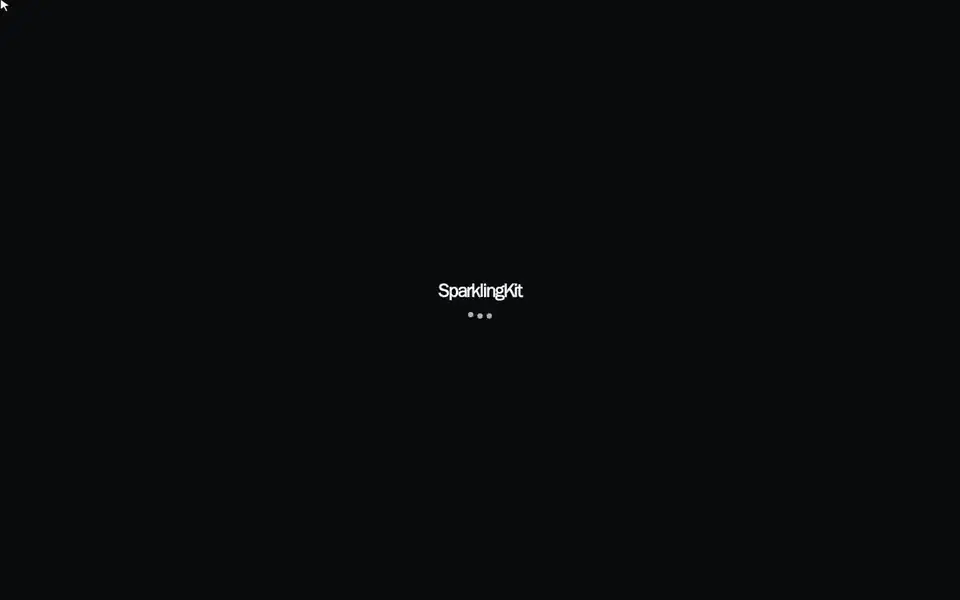

# SparklingKit ⚡ — a local AI workspace for one DGX Spark

[](https://github.com/MovieMaker93/SparklingKit/actions/workflows/ci.yml)
[](https://github.com/MovieMaker93/SparklingKit/actions/workflows/security.yml)
[](#quick-start)
[](https://react.dev)
[](https://expressjs.com)
[](LICENSE)

**SparklingKit turns files into reusable AI work: it reads documents, transcribes recordings, translates, finds things in images, generates pictures, maps ideas and lets you chat about all of it, on models that run on your own DGX Spark.**

Every source and every result stays an ordinary file with its history, so one result can feed the next: a scanned PDF becomes Markdown, then a summary, a mind map or a conversation. Seven specialised models share one Spark behind one interface, and nothing leaves your network.

> [!NOTE]
> **Unofficial fork** of [stevibe/SparklingKit](https://github.com/stevibe/SparklingKit), maintained by [MovieMaker93](https://github.com/MovieMaker93). It is not affiliated with or endorsed by the SparklingKit project. See [what's new in this fork](#whats-new-in-this-fork).

[](.github/media/tour.mp4)

[Watch the tour as MP4](.github/media/tour.mp4) · recorded on one DGX Spark with the real models; only the waits are fast-forwarded.

* * *

## Contents

- [What's new in this fork](#whats-new-in-this-fork)
- [Feature tour](#feature-tour)
- [Quick start](#quick-start)
- [Memory and containers](#memory-and-containers)
- [Why SparklingKit?](#why-sparklingkit) · [One DGX Spark, five bundled models](#one-dgx-spark-five-bundled-models) · [Choose your deployment](#choose-your-deployment)
- [Modules](#modules) · [Workbench](#workbench) · [File-based workflows](#file-based-workflows)
- [Architecture](#architecture) · [API overview](#api-overview) · [Security and privacy](#security-and-privacy)
- [Contributing](#contributing) · [License](#license) · [Acknowledgements](#acknowledgements)

* * *

## What's new in this fork

| Area | What you get |
| --- | --- |
| **Interface** | Light, dark and system themes; a mint accent; one AI-services chip and a compact Spark monitor; a "Running now" strip and readable titles on the Workbench |
| **Gallery** | Every image with thumbnails, filters by source and model, a lightbox and a side-by-side compare |
| **Job pages** | Transcript lines, one per sentence, that seek the player; image zoom with a before/after slider, a document outline, and run history |
| **Chat** | Attach images, PDFs and text files; a thinking control (Off, Low, Medium, High) with the reasoning shown live |
| **Models** | Parakeet-TDT-0.6B-v3 for speech; PaddleOCR-VL-1.6 for OCR; Qwen-Image 2.1 and Qwen-Image-2.1-Turbo for images; seed and step controls |
| **Operations** | One-command install; `spark-switch.sh` to share the Spark with another LLM; long model calls no longer cut off after 300 seconds |
| **Quality** | CI, CodeQL, dependency, secret and container scanning, Dependabot, and releases from Conventional Commits |

Details in [docs/fork.md](docs/fork.md), measured results in [docs/validation.md](docs/validation.md), next steps in the [roadmap](docs/fork.md#roadmap), and instructions for coding agents in [AGENTS.md](AGENTS.md).

* * *

## Feature tour

Each clip is the real app on a DGX Spark with demo files. Only the time spent waiting for a model is fast-forwarded. Click a clip for the full-quality MP4.

### The Workbench

Start anything from one page: drop files, translate text, describe an image or ask the model. Jobs that are running show live progress at the top, and recent work keeps readable names and thumbnails.

[](.github/media/workbench.mp4)

### Read documents (OCR)

PaddleOCR-VL-1.6 turns PDFs and scans into Markdown, keeping headings, tables and reading order, and saves the page layout next to it. Long documents get an outline to jump through; the source view shows exactly what the model produced.

[](.github/media/ocr.mp4)

### Transcribe recordings

Parakeet-TDT-0.6B-v3 turns audio and video into a transcript with one line per sentence, and into subtitles (SRT and WebVTT) cut to a readable size from its word timestamps. Click a line and the player jumps there. On long files it runs 10 to 16 times faster than Qwen3-ASR did, and it needs 1.7 GiB instead of 16.5 GiB. It covers 25 European languages.

[](.github/media/transcript.mp4)

### Generate images

Describe a picture and Qwen-Image-2.1-Turbo draws it in about 18 seconds at 1024 × 1024, or a minute at 2K. Every image lands in the Gallery, where you can filter by model and compare two side by side.

[](.github/media/image.mp4)

### Find things in images

Visual grounding boxes every match for anything you can name, with a slider between the original and the result. It needs a grounding endpoint configured in Settings (this fork used LocateAnything-3B).

[](.github/media/grounding.mp4)

### Chat with your files

Attach images, PDFs or text files with the + button, choose how hard the model should think, and watch its reasoning before the answer. Any finished job can also be opened in a chat.

[](.github/media/chat.mp4)

### Mind maps

Turn a document, transcript or image into an interactive map, then fold and unfold its branches. The map is also saved as JSON and as a Markdown outline.

[](.github/media/mindmap.mp4)

### Dark, light or system

Pick a theme in Settings; the whole interface follows, in both themes and on any screen width.

[](.github/media/theme.mp4)

* * *

## Quick start

You need:
- an NVIDIA DGX Spark (or another GB10 system) with its stock DGX OS, which includes Docker, the NVIDIA container runtime and CUDA 13;
- about 130 GB of free disk for the model weights and service images;
- internet access for the first run.

```bash
git clone https://github.com/MovieMaker93/SparklingKit.git
cd SparklingKit
# Builds the services, downloads the models at pinned revisions, starts everything in a memory-safe order
./scripts/start-dgx-spark.sh --ocr-backend paddleocr-vl --image-backend qwen-image-2.1-turbo --accept-model-licenses
```

- The first run takes 30 to 60 minutes, mostly downloads; later runs reuse everything and take a few minutes.
- `--accept-model-licenses` confirms you have read the [model licenses](#this-fork); two of the models are for non-commercial use only.
- Open `http://<spark-host>:54321` from any device on your network.

| To | Run |
| --- | --- |
| See what is running | `./scripts/start-dgx-spark.sh status` |
| Stop everything (data and models are kept) | `./scripts/start-dgx-spark.sh stop` |
| Switch a model | run the start script again with another `--image-backend`, `--ocr-backend` or `--asr-backend` |
| Use upstream's models instead | leave out `--ocr-backend` and `--image-backend` |
| Update | `git pull`, then run the start script again |
| Share the Spark with another LLM | `./scripts/spark-switch.sh sparklingkit` and `./scripts/spark-switch.sh llm` (see [docs/fork.md](docs/fork.md#sharing-the-spark-with-another-llm)) |
| Run only the app against models you already host | `cp .env.example .env`, set the endpoint URLs, then `docker compose up -d --build` |

**Updating an install that used Qwen3-ASR?** Run the start script again, then choose `Parakeet-TDT-0.6B-v3` under Settings → Services → Speech to text. Saved settings are never rewritten. Until you change it, transcription still works, with minute-long lines instead of sentences.

The one-line installer and the `ghcr.io/stevibe/sparklingkit` images described further down install **upstream** SparklingKit, not this fork.

## Memory and containers

The DGX Spark has about 121 GiB of usable unified memory, shared by the CPU and the GPU. The stack runs **7 Docker containers**, or **8** with PaddleOCR-VL, whose vision model and layout stage run separately. A short-lived downloader container also runs during installation.

Measured on one Spark with every service loaded and idle. GPU is what the container allocates through CUDA; RAM is the container's own process memory.

| # | Container | What it runs | GPU | RAM | Total |
| --- | --- | --- | --- | --- | --- |
| 1 | `sparklingkit-app-1` | Web app, API and job worker | — | 0.1 GiB | 0.1 GiB |
| 2 | `sparklingkit-redis-1` | Job queue | — | < 0.1 GiB | < 0.1 GiB |
| 3 | `sparklingkit-dgx-status` | System monitor | — | < 0.1 GiB | < 0.1 GiB |
| 4 | `sparklingkit-image-generation` | Qwen-Image-2.1-Turbo or 2.1, float8 | 17.1 GiB | 1.9 GiB | **19.0 GiB** |
| 5 | `sparklingkit-parakeet` | Parakeet-TDT-0.6B-v3 in parakeet.cpp (ggml on CUDA), behind a small adapter | 1.5 GiB | 0.2 GiB | **1.7 GiB** |
| 6 | `sparklingkit-paddleocr-vlm` | PaddleOCR-VL-1.6 vision model in vLLM | 5.4 GiB | 3.6 GiB | **9.0 GiB** |
| 7 | `sparklingkit-hy-mt2` | Hy-MT2-1.8B-FP8 translation | 2.4 GiB | 3.0 GiB | **5.4 GiB** |
| 8 | `sparklingkit-paddleocr-vl` | PaddleOCR-VL layout stage (PP-DocLayoutV3, on the CPU) | — | 0.8 GiB | 0.8 GiB |

The stack ships no LLM and no grounding service (chat, mind maps and summaries use any
OpenAI-compatible endpoint, and visual grounding activates when a grounding endpoint is configured —
both in **Settings → Services**; see `docs/fork.md` for the Saluki and LocateAnything reference setups).
Every row is measured. Parakeet grows to 1.6–1.8 GiB of GPU memory and up to 1.5 GiB of RAM while it transcribes.

The alternatives change single rows:

| Instead of | You run | Memory |
| --- | --- | --- |
| Rows 6 and 8 | `sparklingkit-unlimited-ocr` (Unlimited-OCR in vLLM, upstream's default) | Not measured. vLLM may reserve up to 12% of memory (about 15 GiB). |
| Row 4's model | Z-Image-Turbo (upstream's default) | Not measured; the container is capped at 26 GiB. |

| State | Memory used |
| --- | --- |
| All services idle | about 29 GiB |
| Busy (two jobs at a time, the app's default) | about 38 GiB at peak |
| Starting up | about 39 GiB at peak |

These are the measured figures from [docs/validation.md](docs/validation.md) minus the removed Qwen3.6
LLM (31 GiB) and LocateAnything (10.9 GiB); the Parakeet idle figure was measured on the full stack.

The historical 84–96 GiB figures in [docs/validation.md](docs/validation.md) were measured with the
Qwen3.6 LLM and Qwen3-ASR resident, before this fork removed them.

That leaves about 90 GiB for an LLM of your choice (Saluki needs ~13 GiB), a grounding server if you run
one, the system, and headroom under load. Full measurements are in [docs/validation.md](docs/validation.md).

* * *

## Why SparklingKit?

AI work rarely ends after one operation. After recording a meeting, you may want to transcribe it, turn the transcript into a concise summary, and then chat with the result to revisit a decision or find an action item. When a large scanned PDF arrives, you may need to extract it into readable text before summarizing, translating, or asking questions about it. SparklingKit keeps these steps connected instead of treating each one as an isolated task.

The same applies to images: generate one from a prompt, pass it directly into visual grounding, and search for a person, object, text region, or other detail inside it. Every source and generated result remains a typed artifact with its files, lineage, and processing history, so you can always see where it came from and choose a compatible **Continue with** action.

SparklingKit is built around small, atomic capabilities—OCR, transcription, translation, grounding, image generation, mind mapping, and language-model reasoning—that can be combined without coupling the underlying services. A document, set of notes, or image can become an interactive mind map with collapsible branches, while its portable JSON and Markdown outline remain available to other tools. For repeatable work, the node-based workflow editor lets you connect those same capabilities with typed inputs, conditions, branches, merges, and explicit file outputs. Design the flow once, then run it again with a new recording, document, image, or piece of text.

For workloads involving recorded meetings, private documents, scanned PDFs, and personal images, we strongly recommend running models locally whenever suitable hardware is available. Local inference keeps sensitive material on infrastructure you control, avoids repeatedly uploading large files, and gives you direct ownership of model selection, capacity, availability, and data retention. SparklingKit is designed local-first: source files, generated artifacts, processing history, workflow definitions, and service endpoints remain under your control. It is not local-only, however. Compatible cloud APIs can also be configured as service endpoints, allowing SparklingKit to serve as one consistent interface for local models, cloud-hosted models, or a deliberate combination of both.

## One DGX Spark, four bundled models

The reference stack deliberately fits four complementary models onto one DGX Spark. The LLM and the grounding service are deliberately **not** bundled: point SparklingKit at any OpenAI-compatible endpoint (local or cloud) for chat, mind maps, summaries, and workflow prompts, and configure a grounding endpoint for visual grounding.

| Capability | Model | Role in SparklingKit |
| --- | --- | --- |
| OCR | [`baidu/Unlimited-OCR`](https://huggingface.co/baidu/Unlimited-OCR) | Page and image text extraction |
| Speech recognition | [`nvidia/parakeet-tdt-0.6b-v3`](https://huggingface.co/nvidia/parakeet-tdt-0.6b-v3) | Audio/video transcription and subtitles |
| Translation | [`tencent/Hy-MT2-1.8B-FP8`](https://huggingface.co/tencent/Hy-MT2-1.8B-FP8) | Dedicated multilingual translation |
| Image generation | [`Tongyi-MAI/Z-Image-Turbo`](https://huggingface.co/Tongyi-MAI/Z-Image-Turbo) | Fast text-to-image generation |

This gives a small team or individual a practical multimodal workspace without sending every file to a hosted provider. SparklingKit supplies the shared UI, file history, artifact routing, workflows, queueing, and progress monitoring; the five model servers stay independently replaceable.

## Choose your deployment

SparklingKit has two independently deployable layers:

1. the **AI service layer**—the five reference models, your LLM endpoint, and the optional DGX system monitor; and
2. the **workspace layer**—the SparklingKit web application, API, Redis queue, and file data.

Keeping that boundary explicit supports three practical setups without maintaining three different products:

| Setup | AI services | SparklingKit | Best for |
| --- | --- | --- | --- |
| **All in one** | DGX Spark | Same DGX Spark | The simplest out-of-the-box experience |
| **Split** | DGX Spark | Another server | Keeping the DGX focused on inference or sharing it across a network |
| **SparklingKit only** | Your endpoints | Any Docker host | Existing local services, cloud APIs, or a custom mix |

## Install the workspace

The recommended distribution is a prebuilt multi-platform container with a small Docker Compose bundle. It runs SparklingKit and Redis together; model weights are never included in the application image.

> [!NOTE]
> In this fork, the installer and images in this section install upstream SparklingKit. To run the fork, use the [quick start](#quick-start) or one of the source paths below.

```bash
curl -fsSL https://run.sparklingkit.com/stable/install.sh -o install.sh && bash install.sh
```

Open `http://localhost:54321`, or `http://SERVER-IP:54321` from another device on the trusted network. The installation directory is deliberately portable:

```text
sparklingkit/
├── compose.yaml
├── sparklingkit
└── data/                 # settings, jobs, files, chats, workflows, and Redis state
```

The Compose file pulls `ghcr.io/stevibe/sparklingkit` for the host's architecture. It bind-mounts `./data` directly into the application so backing up or moving the workspace does not require extracting a Docker volume.

On the first visit, choose one of three tabs:

### Run models locally

Choose this when SparklingKit and the five models run on the same DGX Spark. Onboarding provides both the hosted, checksum-verified installer and the GitHub-source command, then verifies all five services through Docker's host gateway before applying anything. Configure the LLM endpoint afterwards in **Settings → Services**.

Hosted model-stack installations created with version 0.1.4 or later include `./sparklingkit-dgx update`. It verifies the latest bundle, backs up the installed stack, stops every model service, preserves model and runtime data under `data/`, rebuilds changed adapters, refreshes pulled images, and starts each endpoint sequentially. Failed or interrupted changes restore the previous stack before another update is attempted. Version 0.1.3 and earlier should bootstrap the current updater once by following the [DGX Spark operations guide](docs/dgx-spark.md#operations). Application updates remain independent through `./sparklingkit update` in the workspace installation directory.

### Run models remotely

Choose this when the model stack runs on another DGX Spark. Run the same model installer on the DGX, enter its trusted-network hostname or IP in onboarding, and verify ports 8332–8336. The optional monitor uses port 8330. Keep these ports behind a firewall, LAN, or VPN.

### Configure endpoints manually

Configure only the services you need. Every provider has independent URL, model, API-key, enable, capability, and connection-test controls. Compatible local services and cloud APIs can be mixed.

Reopen onboarding from **Settings → General → Deployment**. Existing configurations are clearly identified, and a reference preset remains staged until **Apply and continue** is pressed. Changing deployment endpoints does not remove jobs, chats, workflows, or files.

### GitHub-source installation

The hosted installer is only a convenience. The equivalent auditable source path is:

```bash
git clone https://github.com/MovieMaker93/SparklingKit.git
cd SparklingKit
./distribution/install.sh --from-source --dir ../sparklingkit-install
```

Developers can continue to use `docker compose up -d --build` from the repository root.

## Upgrade and operate

Run these commands inside the installation directory:

```bash
./sparklingkit update     # verify release assets, pull, recreate, and health-check
./sparklingkit status
./sparklingkit logs
./sparklingkit stop       # never removes ./data
./sparklingkit rollback   # restore the app image used before the last update
```

The default `latest` image follows stable releases. Set `SPARKLINGKIT_IMAGE=ghcr.io/stevibe/sparklingkit:0.2.0` in `.env` to pin an installation. The update command records the previous local image before recreating the application, while the bind-mounted data remains untouched.

See [Application deployment and upgrades](docs/deployment.md) for network binding, pinned releases, rollback limits, backups, and release artifacts.

Set `HF_TOKEN` in the shell when the DGX model download requires authentication or additional download capacity:

```bash
HF_TOKEN=hf_... ./scripts/start-dgx-spark.sh --accept-model-licenses
```

Model weights are downloaded from their publishers and are not part of SparklingKit's Apache 2.0 distribution. Review their terms before setup. The acceptance flag records that you completed this review; it does not alter or override upstream terms.

The DGX starter enables the status reporter, which surfaces unified-memory use, CUDA allocations, GPU utilization and temperature, plus model-service health in the sidebar. See the [DGX Spark deployment guide](docs/dgx-spark.md) for hosted and source installation, prerequisites, network layout, storage locations, operational commands, and model-license notes.

## Modules

| Module | Typical input | Output |
| --- | --- | --- |
| OCR | Images, scanned PDFs | Markdown documents and structured page data |
| Transcription | Audio and video | Markdown transcripts, JSON segments (and word times with Parakeet), SRT, and VTT |
| Translation | Pasted text, documents, transcripts | Translated text or document artifacts |
| Grounding | Images and text queries | Framed image preview and normalized box annotations |
| Text to image | Prompt or compatible text result | Generated image |
| Mind map | Topic, text result, structured data, or an image with a vision-capable LLM | Interactive JSON map and Markdown outline |
| Chat | Text, documents, structured data, and optionally images | Referenced conversation |

Each module has its own history rail, source preview, and detail view. Jobs, chats, source files, and generated files can be renamed or deleted. Compatible outputs expose actions such as translating a transcript, grounding a generated image, creating an image from text, or opening a result in chat.

## Workbench

The Workbench collects common actions into a lightweight grid:

- format-aware file intake for OCR, transcription, and document translation;
- debounced live text translation with an explicit **Save** action;
- text-to-image generation with common canvas sizes;
- a chat starter;
- a shortcut to image grounding;
- a shortcut to interactive mind-map generation;
- enabled reusable workflows;
- searchable recent work.

Global search covers work, conversations, tools, and generated artifacts. Service health and the optional machine-status monitor remain visible from the collapsible sidebar.

## File-based workflows

The visual workflow editor composes the same modules used everywhere else in SparklingKit. Definitions are versioned JSON files stored under `data/config/workflows/`; each run stores an immutable definition snapshot with the job.

Service nodes:

- OCR
- Transcription
- Translation
- Grounding
- Text to image
- Mind map
- LLM prompt
- Create chat

Generic nodes:

- **Input** declares accepted artifact types.
- **Select** narrows results by artifact kind.
- **If** and **Switch** route artifacts through declarative conditions.
- **Merge** rejoins active branches.
- **Save to file** stores incoming content or explicitly defined text.
- **End** collects a successful result.
- **Fail** ends a path with a readable error.

Connections are allowed only when a producer and consumer share compatible artifact types. Workflow JSON cannot execute arbitrary JavaScript or shell commands.

Service nodes store their output by default. Turn off **Store the result** for an intermediate value that should exist only during execution; downstream nodes can still consume it, and SparklingKit removes it when the run finishes. Use **Save to file** when a particular intermediate result should become a durable artifact.

During execution the run view highlights the active node and records succeeded, skipped, failed, or cancelled paths. Historical workflow jobs retain this node diagram, selected branches, durations, child service runs, and artifact lineage.

See [Workflow design and JSON contracts](docs/workflows.md) for details.

## Manual source deployment

### Requirements

- Docker Engine with Docker Compose
- One or more compatible local, remote, or cloud inference services

For a source-built Compose deployment, clone and configure the project:

```bash
git clone https://github.com/MovieMaker93/SparklingKit.git
cd SparklingKit
cp .env.example .env
```

Either leave endpoint URLs empty to use browser onboarding or edit `.env` with services already available on your network, then start the application:

```bash
docker compose up -d --build
```

Open [http://localhost:54321](http://localhost:54321).

Application state is written to `./data`. The release bundle also stores Redis state under `./data/.redis`; the development Compose file uses a named Redis volume. The application image includes `ffmpeg`, `ffprobe`, `pdftotext`, and `pdftoppm` and supports `linux/amd64` and `linux/arm64`.

Environment variables bootstrap a new `settings.json`; saved settings take precedence on later starts so upgrades do not replace a user's endpoints. After first launch, manage providers from **Settings → Services** or reopen **Settings → General → Deployment**. If you are deploying the complete reference stack directly on a DGX Spark, use `scripts/start-dgx-spark.sh` instead.

## Service configuration

Every provider can be enabled, edited, and tested independently. The DGX Spark reference deployment exposes its five bundled models on adjacent ports (8332–8336); the LLM endpoint is any service you configure:

| Port | Capability | Reference model/backend |
| ---: | --- | --- |
| 8330 | Optional system status | Lightweight Python API |
| 8332 | OCR | Unlimited-OCR |
| 8333 | Speech recognition | Parakeet-TDT-0.6B-v3 / parakeet.cpp |
| 8334 | Translation | Hy-MT2-1.8B-FP8 |
| 8336 | Image generation | Z-Image-Turbo / Diffusers |

The system-status service is optional. Leave its URL empty to hide the GPU/memory block without affecting service health indicators.

LLM settings declare text and image input capabilities. SparklingKit uses those flags when deciding whether images can be attached to Chat or connected to LLM workflow nodes.

Advanced settings expose machine-dependent processing controls, including transcription chunk size and overlap, adaptive splitting, request timeouts, PDF rasterization, queue concurrency, retries, and work-directory retention. Display timezone is selected separately under **Settings → General**.

### Optional DGX Spark status reporter

The repository includes a small read-only status service for NVIDIA DGX Spark deployments. The full DGX starter enables it automatically; to add it to an otherwise manual deployment, run:

```bash
docker compose -f compose.spark.yaml up -d --build dgx-status
```

Point **Settings → Services → System monitor** to its base URL. SparklingKit runs normally without it.

## Local development

### Requirements

- Node.js 22 or newer
- Redis
- ffmpeg and ffprobe
- Poppler (`pdftotext` and `pdftoppm`)

```bash
cp .env.example .env
npm install
npm run dev
```

The API runs at `http://localhost:54321`. Vite runs at `http://localhost:5173` and proxies `/api` to the API.

Useful checks:

```bash
npm run typecheck
npm test
npm run build
```

## Architecture

SparklingKit is a TypeScript modular monolith:

```text
React client
    │
    ▼
Express API ───────────► configurable inference services
    │
    ├── BullMQ / Redis       execution coordination
    │
    └── data/                durable source of truth
          ├── settings and workflow definitions
          ├── jobs, artifacts, and flow snapshots
          └── chats and references
```

Core ideas:

- A **module** is a user-facing capability.
- A **provider** is the configured model endpoint behind that capability.
- A **job** is a portable container for sources, artifacts, and runs.
- An **artifact** is a typed file with stable identity and lineage.
- A **workflow run** is a durable invocation with independent progress, cancellation, outputs, and errors.

Redis may be restarted or rebuilt without replacing the file-based record. Job manifests use atomic write-and-rename updates, and API keys are stored separately in `data/config/secrets.json` with restrictive file permissions.

Read [Architecture](docs/architecture.md) and the [modular-monolith ADR](docs/adr/0001-modular-monolith.md) before adding a module or changing storage contracts.

## Data layout

```text
data/
├── config/
│   ├── settings.json
│   ├── secrets.json
│   ├── prompts/*.json
│   └── workflows/*.json
├── jobs/<job-id>/
│   ├── job.json
│   ├── flows/*.json
│   ├── input/
│   ├── work/
│   └── output/
├── chats/<chat-id>/chat.json
└── logs/
```

Back up the entire `data/` directory to preserve configuration, work history, source files, chats, and generated results. Redis is operational state, not the permanent record.

## API overview

| Area | Endpoints |
| --- | --- |
| Health and configuration | `GET /api/health`, `GET/PUT /api/settings`, `GET /api/modules` |
| Search | `GET /api/search` |
| Jobs | `GET/POST /api/jobs`, job/file rename and delete routes, cancellation, SSE progress |
| Artifacts and runs | `GET /api/jobs/:id/artifacts`, `GET/POST /api/jobs/:id/runs` |
| Translation | preview, pasted-text, and uploaded-document routes under `/api/modules/translation` |
| Grounding | `POST /api/modules/grounding/jobs` |
| Image generation | `POST /api/modules/text-to-image/jobs` |
| Mind map | `POST /api/modules/mindmap/jobs` |
| Chat | chat CRUD and streaming messages under `/api/chats` |
| Workflows | definition CRUD/validation and durable flow runs under `/api/workflows` |

See the server routes and [architecture documentation](docs/architecture.md) for request contracts.

## Security and privacy

SparklingKit currently assumes a trusted user and trusted network. It does not provide built-in authentication or multi-tenant isolation. Do not expose it directly to the public internet; place it behind an authenticated reverse proxy, VPN, or equivalent access control.

Uploaded content is sent to the inference endpoints you configure. A self-hosted SparklingKit deployment is only as private as those services and the surrounding network. Review endpoint ownership, logs, retention, and transport security before processing sensitive material.

Grounding overlays are previews, not secure redaction. A visible rectangle over an image or selectable PDF text does not remove the underlying information.

## Contributing

Issues and pull requests are welcome. Before opening a pull request:

1. Keep module compatibility rules in the shared capability router rather than duplicating them in UI code.
2. Preserve the file-based storage model and artifact lineage.
3. Add or update tests for behavioral changes.
4. Run `npm run typecheck`, `npm test`, and `npm run build`.
5. Avoid committing `.env`, `data/`, model credentials, or user files.
6. Title the pull request as a [Conventional Commit](https://www.conventionalcommits.org/) (`feat: …`, `fix: …`); it becomes the squashed commit that release notes are built from.

Coding agents, and humans who like a map, start from [AGENTS.md](AGENTS.md). The README clips are recorded by `scripts/media/`; see its README to refresh them after UI changes.

The project is currently pre-1.0, so APIs and persisted schemas may still evolve. Migrations should remain additive and must not silently rewrite user folders.

## License

SparklingKit is licensed under the [Apache License 2.0](LICENSE).

Third-party packages and model services remain subject to their respective license terms.

Copyright 2026 Steven Lei.

### This fork

This fork is distributed under the same Apache License 2.0 and keeps upstream's [LICENSE](LICENSE) and [NOTICE](NOTICE). Its changes are recorded in the commit history and summarised in [docs/fork.md](docs/fork.md). "SparklingKit" is the upstream project's name; the fork uses it only to say where the code comes from.

Model weights are not part of this repository. The start script downloads them after you accept their terms, and some are not for commercial use: Qwen-Image 2.1 and Qwen-Image-2.1-Turbo use the Qwen Research License. Parakeet-TDT-0.6B-v3, the default speech model, is NVIDIA's and uses CC BY 4.0, which allows commercial use with credit (see the acknowledgements); parakeet.cpp, which runs it, is MIT.

Fork changes copyright 2026 MovieMaker93.

## Acknowledgements

- [stevibe/SparklingKit](https://github.com/stevibe/SparklingKit) by Steven Lei, the project this fork builds on.
- The model teams whose open weights do the work: Qwen ([Qwen-Image 2.1](https://huggingface.co/Qwen/Qwen-Image-2.1)), PaddlePaddle ([PaddleOCR-VL](https://huggingface.co/PaddlePaddle/PaddleOCR-VL-1.6)), Baidu ([Unlimited-OCR](https://huggingface.co/baidu/Unlimited-OCR)), Tencent ([Hy-MT2](https://huggingface.co/tencent/Hy-MT2-1.8B-FP8)), NVIDIA ([Parakeet TDT 0.6B v3](https://huggingface.co/nvidia/parakeet-tdt-0.6b-v3), under [CC BY 4.0](https://creativecommons.org/licenses/by/4.0/)) and Tongyi-MAI ([Z-Image-Turbo](https://huggingface.co/Tongyi-MAI/Z-Image-Turbo)).
- A model evaluated for what comes next: [Underdog Saluki 27B](https://huggingface.co/ConwayResearch/Underdog-Saluki-27B-1.0).
- The serving and tooling stack: [parakeet.cpp](https://github.com/mudler/parakeet.cpp) by mudler (MIT), which runs Parakeet from its [GGUF files](https://huggingface.co/mudler/parakeet-cpp-gguf), [vLLM](https://github.com/vllm-project/vllm), [llama.cpp](https://github.com/ggml-org/llama.cpp), [diffusers](https://github.com/huggingface/diffusers), [PaddleOCR](https://github.com/PaddlePaddle/PaddleOCR), React, Express, BullMQ, Vite, and [Playwright](https://playwright.dev), which records the README clips.
- The demo transcript reads from [LibriSpeech](https://www.openslr.org/12) (CC BY 4.0); the demo report is fictional.
- The README layout takes its cue from [sparkDash](https://github.com/MiaAI-Lab/sparkDash).
